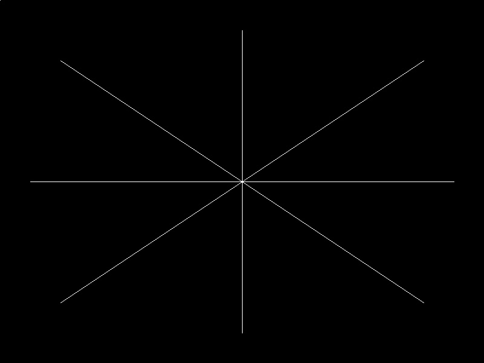

# Polygon-Bresenham

Framebuffer en Rust con trazado de líneas usando el algoritmo de Bresenham (todos los octantes).

## Estructura

- `polygon/src/framebuffer.rs` — buffer de píxeles (`Framebuffer`)
- `polygon/src/line.rs` — `draw_line(fb, x0, y0, x1, y1)` con Bresenham
- `polygon/src/bmp.rs` — escritura del framebuffer a `.bmp`
- `polygon/src/main.rs` — punto de entrada

## Salida



Generado con:

```
cd polygon
cargo run
```
